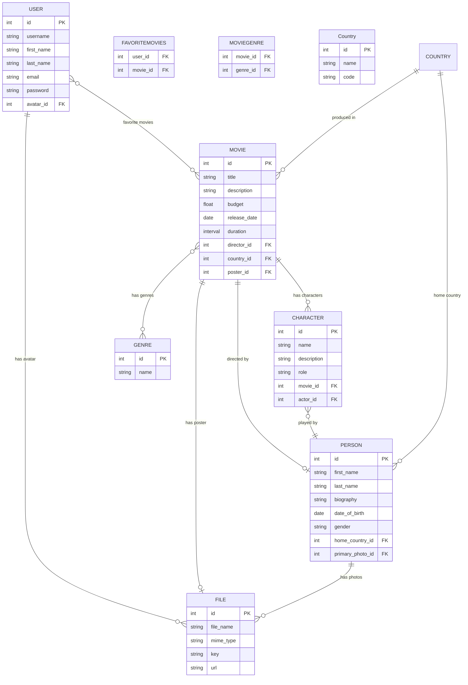

# README #

```mermaid
erDiagram
    USER {
        int id PK
        string username
        string first_name
        string last_name
        string email
        string password
        int avatar_id FK
    }
    
    FILE {
        int id PK
        string file_name
        string mime_type
        string key
        string url
    }
    
    MOVIE {
        int id PK
        string title
        string description
        float budget
        date release_date
        interval duration
        int director_id FK
        int country_id FK
        int poster_id FK
    }
    
    CHARACTER {
        int id PK
        string name
        string description
        string role
        int movie_id FK
        int actor_id FK
    }
    
    PERSON {
        int id PK
        string first_name
        string last_name
        string biography
        date date_of_birth
        string gender
        int home_country_id FK
        int primary_photo_id FK
    }
    
    GENRE {
        int id PK
        string name
    }
    
    FAVORITEMOVIES {
        int user_id FK
        int movie_id FK
    }
    
    MOVIEGENRE {
        int movie_id FK
        int genre_id FK
    }

    Country {
        int id PK
        string name
        string code
    }
    
    USER ||--o{ FILE : "has avatar"
    MOVIE ||--o| PERSON : "directed by"
    MOVIE ||--o| FILE : "has poster"
    MOVIE }o--o{ GENRE : "has genres"
    MOVIE ||--o{ CHARACTER : "has characters"
    CHARACTER }o--|| PERSON : "played by"
    PERSON ||--o{ FILE : "has photos"
    USER }o--o{ MOVIE : "favorite movies"
    COUNTRY ||--o{ MOVIE : "produced in"
    COUNTRY ||--o{ PERSON : "home country"

```
