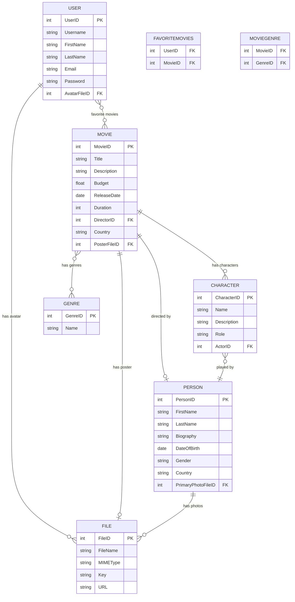

# README #

```mermaid
erDiagram
    USER {
        int UserID PK
        string Username
        string FirstName
        string LastName
        string Email
        string Password
        int AvatarFileID FK
    }
    
    FILE {
        int FileID PK
        string FileName
        string MIMEType
        string Key
        string URL
    }
    
    MOVIE {
        int MovieID PK
        string Title
        string Description
        float Budget
        date ReleaseDate
        int Duration
        int DirectorID FK
        string Country
        int PosterFileID FK
    }
    
    CHARACTER {
        int CharacterID PK
        string Name
        string Description
        string Role
        int ActorID FK
    }
    
    PERSON {
        int PersonID PK
        string FirstName
        string LastName
        string Biography
        date DateOfBirth
        string Gender
        string Country
        int PrimaryPhotoFileID FK
    }
    
    GENRE {
        int GenreID PK
        string Name
    }
    
    FAVORITEMOVIES {
        int UserID FK
        int MovieID FK
    }
    
    MOVIEGENRE {
        int MovieID FK
        int GenreID FK
    }
    
    USER ||--o{ FILE : "has avatar"
    MOVIE ||--o| PERSON : "directed by"
    MOVIE ||--o| FILE : "has poster"
    MOVIE }o--o{ GENRE : "has genres"
    MOVIE ||--o{ CHARACTER : "has characters"
    CHARACTER }o--|| PERSON : "played by"
    PERSON ||--o{ FILE : "has photos"
    USER }o--o{ MOVIE : "favorite movies"

```
